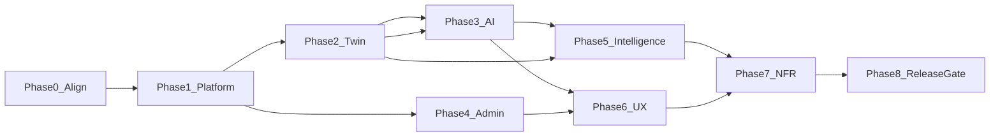
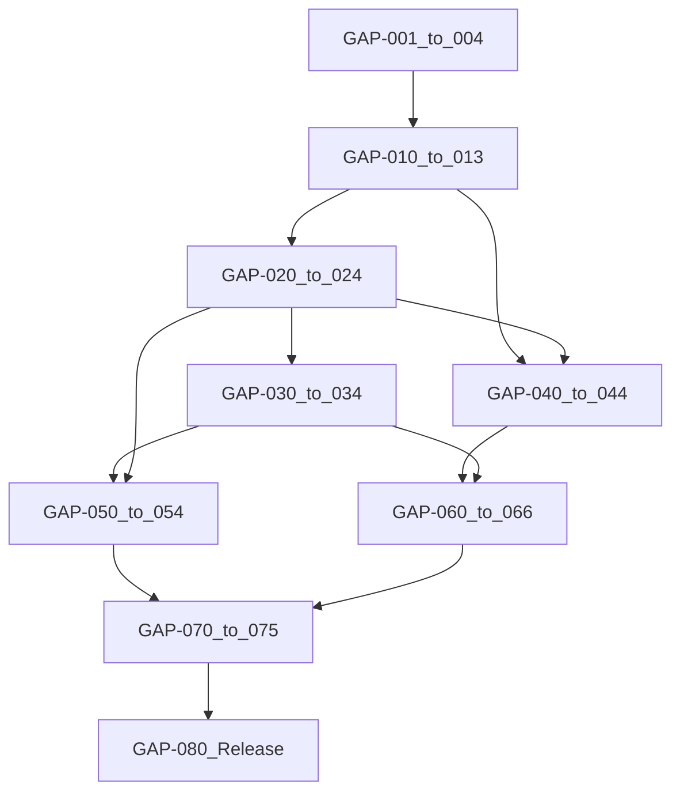

# Missing Modules & Features Implementation Plan (Execution-Ready)

## 0. Document control

| | |
|---|---|
| **Purpose** | Close SRS gaps with an honest, dependency-aware, FE↔BE↔DB↔integration execution plan |
| **Requirement authority** | [HAPPY-VEGGIE-SRS.md](../../HAPPY-VEGGIE-SRS.md) v1.3 |
| **Implementation contract** | [05-Frontend-Backend-Integration.md](../05-Frontend-Backend-Integration.md) + `src/HappyVeggie.Api/Controllers/*` |
| **Architecture refs** | [03-Backend-Technical-Design.md](../03-Backend-Technical-Design.md) · [04-AI-Technical-Design.md](../04-AI-Technical-Design.md) · [02-Frontend-Technical-Design.md](../02-Frontend-Technical-Design.md) |
| **Related plans** | [00-Master](00-Master-Implementation-Plan.md) · [01-Backend](01-Backend-Task-Plan.md) · [02-Frontend](02-Frontend-Task-Plan.md) · [03-AI](03-AI-Task-Plan.md) · [04-Integration](04-Integration-Task-Plan.md) |
| **Companion docs (execution)** | [07-Status-Honesty-Matrix](07-Status-Honesty-Matrix.md) · [08-TBD-Decision-Register](08-TBD-Decision-Register.md) · [09-Provider-Architecture](09-Provider-Architecture.md) · [10-Observability](10-Observability.md) · [11-Backup-Restore](11-Backup-Restore.md) · [12-Release-Gate-GAP-080](12-Release-Gate-GAP-080.md) |
| **Non-authority for scope** | PRD / Dev Spec where they conflict with SRS (UX hints only after alignment) |
| **Canonical location** | `docs/implementation/06-Missing-Modules-Features-Implementation-Plan.md` |
| **This revision** | Synced into repo docs from execution-ready GAP plan (Phases 0–8, GAP-001–080) |

**Post-execution status:** Phase 0–8 vertical slices were implemented against this backlog. Live vendors / MFA / portfolio remain **BLOCKED** or **TBD**. Release readiness is tracked in [12-Release-Gate-GAP-080.md](12-Release-Gate-GAP-080.md) (currently **NOT READY** for production). Do not treat historical "NOT STARTED" rows below as current runtime status without checking companion docs 07 / 08 / 12.

### Status vocabulary (mandatory)

| Status | Meaning |
|--------|---------|
| **IMPLEMENTED** | Demonstrably meets SRS DoD (§3) with evidence |
| **PARTIAL** | Code/routes/entities exist but SRS criteria incomplete |
| **MISSING** | Not present end-to-end |
| **BLOCKED** | Cannot proceed until named dependency completes |
| **TBD** | Product/architecture decision required; do not invent |
| **DEFERRED** | Explicitly out of current release / approved deferral |

### Task workflow statuses

`NOT STARTED → IN PROGRESS → BLOCKED → READY FOR QA → VERIFIED → DONE`

**Rule:** Do **not** mark **DONE** because entities, stubs, routes, or fixture UIs exist. DONE requires §3 Definition of Done.

---

## 1. Executive summary

Happy Veggie has a **PARTIAL P0 shell**: farmer OTP, Farm→PA→Zone CRUD (no soft-delete), twin GET/refresh shell, stub-LLM plans/assistant, heuristic green score, experimental list/approve, admin login + read catalogs + rates CRUD, farmer setup wizard, en/ur RTL.

It is **not SRS-complete**. Critical honesty issues:

1. Live **LLM / weather / soil / SMS OTP** are stubs or unwired
2. **Water / soil upsert / economics HTTP / soft-delete / auth refresh** missing or thin
3. **Admin depth** (mutations, review, flags, analytics, twin inspect, MFA, write-audit) incomplete
4. **P1 intelligence** (portfolio, learning, persisted alerts, experimental loop, PDF, native mobile) largely MISSING or PARTIAL
5. Master/Backend/AI/Frontend plans **overstate DONE**

**Execution principle:** implement **vertical slices**  
`SRS FR → Task → Contract → Backend → DB → Frontend → Integration/E2E → Evidence → DONE`  
not “all backend then all frontend.”

**Critical dependency chain (enforced):**  
`Providers + Water/Soil/Economics → Meaningful Twin → Grounded AI → Plans/Assistant → Portfolio/Learning`  
Downstream intelligence tasks stay **BLOCKED** until foundations are VERIFIED.

---

## 2. Definition of Done (project-wide)

A requirement/task may be marked **DONE** only when **all applicable** items are true:

1. Backend implementation exists and matches Doc 05 / controllers contract
2. Required DB migrations/entities complete
3. Integration contract documented (Doc 05 updated if changed)
4. Frontend integrated where the FR requires UI
5. Loading / error / empty / retry states handled
6. AuthZ: farmer owner-scope or admin role as required
7. Audit and/or provenance satisfied where SRS requires
8. Automated tests where applicable (unit/API/component)
9. FE↔BE integration or E2E verified with recorded evidence
10. Demonstrable against SRS acceptance intent for that FR

If an item is N/A (e.g. no UI for a pure backend NFR), the task notes **why**.  
**PARTIAL shell code ≠ DONE.**

### Traceability chain (mandatory per FR)

`SRS FR/NFR → GAP-xxx task → API/Contract → Backend → Frontend → Test → Evidence → DONE`

Use this to correct overstated Master/Backend/AI/Integration statuses before claiming release readiness.

---

## 3. Module inventory (honest status)

| Module | SRS | Overall | Notes |
|--------|-----|---------|-------|
| Auth / profile | FR-001,017,018,044 | PARTIAL | OTP+profile; no refresh/revoke; live SMS TBD |
| Farm / PA / zones | FR-045–049,109–114 | PARTIAL | CRUD; no soft-delete; wizard exists |
| Digital Twin | FR-051–055,115–116 | PARTIAL | GET/refresh; providers unwired |
| Weather | FR-067–070 | PARTIAL | Stub exists, unused on refresh |
| Soil | FR-071–074 | PARTIAL | Entity; no upsert API; wizard soil type only |
| Water | FR-050,075–078 | PARTIAL | Entity; no CRUD API; wizard yes/no |
| Planning | FR-007–012,022–025 | PARTIAL | Stub LLM; history API, thin history UI |
| Compatibility | FR-030,032,099–103 | PARTIAL | Seed table; no neighbour set API |
| Nearby / suggestions | FR-033–035,084–085 | PARTIAL | Farm-scoped GET; thin UI |
| Seed varieties | FR-104–107 | PARTIAL | API exists; FE picker unused |
| AI Assistant | FR-060–066,118 | PARTIAL | Persist+stub LLM |
| Green Farm | FR-127–133 | PARTIAL | Availability heuristic ≠ full score model |
| Experimental | FR-086–089,119 | PARTIAL | List+approve; no outcome/learn |
| Learning / CropCycle | FR-090–092,096 | MISSING | Entity only |
| Economics | FR-079–082 | PARTIAL | Service/rates; no farmer `/economics` HTTP/UI |
| Gov rates admin | FR-083 | PARTIAL | CRUD exists; audit incomplete |
| Alerts | FR-036–037,093–095 | PARTIAL | Computed; not persisted |
| Protected farming | FR-121–126 | PARTIAL | Types; rich attrs/AI TBD |
| Portfolio optimizer | FR-056–059,117 | MISSING | — |
| Admin console | FR-038–042,097 | PARTIAL | Reads+rates; mutations/flags/twin/review gaps |
| Localization | FR-015–016 | PARTIAL | en/ur; PDF RTL still open |
| PDF share | FR-024 | MISSING | Or formal deferral |
| Mobile native | FR-043,098 | DEFERRED/TBD | Web P0 OK per FR-098 |
| Audit / security NFR | FR-042, NFR-* | PARTIAL | Table+GET; write-path weak |

Prior gap analysis (Critical/High/Medium tables from prior revision) remains valid; all items are mapped into GAP-xxx below. Nothing was removed merely to look cleaner.

---

## 4. Phase roadmap (vertical slices)

Phases preserve dependencies while allowing FE+BE+contract work **per slice**.

### Phase 0 — Contract & Architecture Alignment
**Goal:** Stop false DONE; freeze contracts; register TBDs.  
**Slices:** status reconciliation, Doc 05 gap register, TBD decision log, provider interface design (no vendor pick).

### Phase 1 — Core Platform
**Goal:** Auth lifecycle, soft-delete, cross-cutting audit, feature-flag surface.  
**Slices:** each delivers BE+contract+FE+tests together.

### Phase 2 — Real Digital Twin
**Goal:** Weather/soil wired; water/soil APIs; economics HTTP; twin shows real enrichment with degrade paths.  
**Blocked until:** Phase 1 soft-delete/auth basics READY FOR QA (recommended); provider interfaces from Phase 0.

### Phase 3 — Real AI & Planning
**Goal:** Live LLM adapter behind flag; grounded plan/assistant; cost logging; stub remains for tests.  
**Blocked until:** Phase 2 twin water/soil/economics VERIFIED enough for grounding (or explicit degrade documented).

### Phase 4 — Admin Operations
**Goal:** Catalog mutations, plan review, twin inspect, analytics, flags UI live, MFA decision path.  
**Can parallelize** with Phase 2–3 after Phase 1 audit is in place (admin writes must audit).

### Phase 5 — P1 Intelligence
**Goal:** Persisted alerts, experimental loop, learning minimum, green depth, portfolio (last).  
**Blocked until:** Phase 2–3 foundations VERIFIED per dependency chain.

### Phase 6 — UX / Feature Parity
**Goal:** PDF or approved deferral, map TBD, zone drawer, plan history UI, variety picker, optional `/graphic`.

### Phase 7 — Hardening & NFR
**Goal:** Rate limits, observability, backups, graceful provider failure evidence.

### Phase 8 — Release / SRS Compliance Gate
**Goal:** Evidence pack; no Critical open gaps; TBD decisions resolved or formally deferred.

**Deviation note:** Admin (Phase 4) is parallel to Twin/AI after audit (Phase 1), not after all AI—because admin catalog/rates unblock content without waiting for live LLM. Portfolio remains after Twin+Economics+AI.

---

## 5. Master implementation backlog

IDs: `GAP-###`. Priority: Critical / High / Medium / Low.  
Statuses below are **current** (plan time). Acceptance is slice-level.

### Phase 0 — Alignment

#### GAP-001 — Reconcile overstated task DONE
- **Module:** Process / docs | **SRS:** Traceability / release honesty | **Pri:** Critical | **Status:** NOT STARTED
- **Backend/DB/FE:** N/A (documentation)
- **Integration:** Reset Master / Backend / AI / Frontend / Integration statuses to PARTIAL where shell-only
- **Deps:** None
- **Acceptance:** No track marks DONE without §2 DoD evidence; published status matrix
- **Test/E2E:** N/A | **Release:** Blocks Phase 8 gate

#### GAP-002 — Doc 05 contract gap register
- **Module:** Integration | **SRS:** EIR-003; Doc 05 §6 | **Pri:** Critical | **Status:** NOT STARTED
- **Work:** List implemented vs missing endpoints vs SRS; update Doc 05 matrix
- **Deps:** GAP-001
- **Acceptance:** Doc 05 lists water/soil/economics/soft-delete/admin twin/flags/analytics/catalog writes/review/auth refresh as missing or scheduled with task IDs
- **Evidence:** Updated Doc 05 + Integration plan

#### GAP-003 — TBD decision register
- **Module:** Architecture / product | **SRS:** App B/G TBDs | **Pri:** Critical | **Status:** NOT STARTED
- **Items (do not invent):** Admin MFA vs SSO; LLM/SMS/weather/soil vendors; Green Score weights; map lib; nearby cohort N; mixed-unit display; native mobile scope; FR-024 PDF deferral; auth refresh token shape; alert cadence; portfolio algorithm; learning-delta feed rules
- **Acceptance:** Decision log with owner + date + “blocks which GAP-xxx”
- **Decision status:** TBD

#### GAP-004 — Provider architecture blueprint
- **Module:** Providers | **SRS:** C-002, EIR-004–008,010; NFR-015 | **Pri:** Critical | **Status:** NOT STARTED
- **Work:** Confirm/document interfaces for `ILlmProvider`, `IWeatherProvider`, `ISoilProvider`, `IOtpProvider`; stub + live adapter slots; config/secrets; flags; timeout/retry/degrade; cost logging for LLM
- **Deps:** GAP-003 for vendor (live adapter may remain NotImplemented until decided)
- **Acceptance:** Architecture note in Doc 03/04; DI registration pattern agreed; **no vendor lock-in in domain**
- **FE:** N/A

---

### Phase 1 — Core Platform (vertical slices)

#### GAP-010 — Auth refresh / revoke
- **Module:** Auth | **SRS:** FR-044 | **Pri:** Critical | **Status:** NOT STARTED
- **Backend:** Refresh + revoke endpoints (exact shape frozen in Doc 05 after GAP-003 if TBD)
- **DB:** Token/session persistence as required by chosen JWT design
- **FE:** Farmer + admin token refresh; logout clears server session if applicable
- **Contract:** Doc 05 §3 update
- **Deps:** GAP-002, GAP-003 (refresh shape if TBD)
- **Acceptance:** Expired access recoverable via refresh; revoke forces re-auth; 401 path unchanged for invalid tokens
- **E2E:** Login → use API → refresh → revoke → 401
- **Release impact:** Critical gate

#### GAP-011 — Soft-delete farm / PA / zone
- **Module:** Farm | **SRS:** C-009, FR-045 | **Pri:** Critical | **Status:** NOT STARTED
- **Backend:** Soft-delete endpoints (DELETE or PATCH `isDeleted`) using existing flags
- **DB:** Confirm indexes/filters exclude deleted by default; define cascade vs orphan rules for twin/plans
- **FE:** Re-enable delete with confirm; lists omit deleted
- **Contract:** Doc 05
- **Deps:** GAP-002
- **Acceptance:** Soft-deleted entities hidden from default lists; owner-scoped; no hard delete required
- **E2E:** Create → delete → absent from list; twin excludes deleted

#### GAP-012 — Cross-cutting admin audit
- **Module:** Admin / Security | **SRS:** FR-042, NFR-008, C-005 | **Pri:** Critical | **Status:** NOT STARTED
- **Backend:** Middleware/behavior writing audit on privileged ops
- **Audit record fields:** actor (admin id/email), action, resource type/id, timestamp UTC, result (success/fail + code), before/after where appropriate, correlation/request id, security context (role, IP if available)
- **Cover at minimum:** catalog mutations, rates CRUD, farmer search/detail/twin inspect, plan review, feature-flag changes, destructive soft-deletes
- **DB:** Use/extend `AdminAuditLog`
- **FE:** Audit log page shows new events
- **Deps:** None for design; required **before** GAP-040+ write slices can be DONE
- **Acceptance:** Each covered action produces one audit row; GET audit returns them
- **E2E:** Perform rate create → visible in audit

#### GAP-013 — Feature flags API foundation
- **Module:** Admin | **SRS:** FR-097 | **Pri:** High | **Status:** NOT STARTED
- **Backend:** FeatureFlag entity + GET/PATCH `/admin/feature-flags`
- **DB:** Migration
- **FE:** Replace EmptyState with live list/toggle
- **Flags (initial names finalized in Doc 05):** OTP mock/live, weather enrichment, soil enrichment, LLM live
- **Deps:** GAP-012 (audit toggles)
- **Acceptance:** Toggle persists; audited; apps read flags server-side for providers

---

### Phase 2 — Real Digital Twin

#### GAP-020 — Wire weather into twin refresh
- **Module:** Twin/Weather | **SRS:** FR-053,067–070; EIR-005 | **Pri:** Critical | **Status:** NOT STARTED
- **Backend:** `RefreshTwin` calls `IWeatherProvider`; store/status on twin; timeout/degrade
- **DB:** Persist via existing TwinSnapshot / designed fields—do not invent beyond Doc 03 model
- **FE:** Twin/weather UI shows data or degrade message
- **Deps:** GAP-004; live vendor GAP-003 TBD (stub wiring can reach VERIFIED; live separate)
- **Acceptance:** Refresh updates weather status; provider failure does not block farm CRUD (EIR-005)
- **E2E:** Refresh with stub success; force failure → CRUD still works

#### GAP-021 — Wire soil provider + soil upsert API
- **Module:** Soil | **SRS:** FR-071–074; EIR-006 | **Pri:** High | **Status:** NOT STARTED
- **Backend:** Upsert soil profile with provenance; refresh may call `ISoilProvider`
- **DB:** Use `SoilProfile`
- **FE:** Soil form + ProvenanceBadge
- **Deps:** GAP-004, GAP-002
- **Acceptance:** Farmer can upsert measured soil; provenance labeled; unknown soil never blocks plan (FR-074)
- **E2E:** Upsert → twin/soil reflects

#### GAP-022 — Water sources CRUD
- **Module:** Water | **SRS:** FR-050,075–076 | **Pri:** High | **Status:** NOT STARTED
- **Backend:** GET/POST/PATCH `/farms/{id}/water-sources` (freeze path in Doc 05 first)
- **DB:** `WaterSource` entity
- **FE:** Water management UI under farm
- **Deps:** GAP-002
- **Acceptance:** Multiple sources; twin water summary uses real sources
- **E2E:** Create source → twin shows count/type

#### GAP-023 — Economics HTTP + farmer UI
- **Module:** Economics | **SRS:** FR-079–082 | **Pri:** High | **Status:** NOT STARTED
- **Backend:** Expose economics via API using existing `EconomicsService` patterns; snapshot entity only if Doc 03 requires—**TBD if new table needed**
- **FE:** Economics display with historical-reference disclaimer (C-006)
- **Deps:** Admin rates (PARTIAL exists); GAP-002
- **Acceptance:** Response distinguishes historical reference vs estimate; disclaimer visible
- **E2E:** Farm with rates → economics view loads

#### GAP-024 — Twin DTO completeness pass
- **Module:** Twin | **SRS:** FR-052,054,115 | **Pri:** High | **Status:** NOT STARTED
- **Backend:** Populate green/water/soil/weather summaries from real data paths
- **FE:** TwinSummaryPanel / FarmGraphic bind without inventing fields
- **Deps:** GAP-020–023
- **Acceptance:** GET twin returns non-placeholder summaries when data exists
- **E2E:** Twin bind FarmGraphic (Integration TASK-131 evidence)

---

### Phase 3 — Real AI & Planning

#### GAP-030 — Live LLM adapter (vendor TBD)
- **Module:** AI | **SRS:** EIR-004, C-003, NFR-007 | **Pri:** Critical | **Status:** BLOCKED until GAP-003 vendor
- **Backend:** `LiveLlmProvider` implementing `ILlmProvider`; secrets server-side; timeouts; usage/cost log
- **FE:** Existing loading/retry only
- **Flags:** LLM live vs stub
- **Deps:** GAP-003 vendor, GAP-004, GAP-013
- **Acceptance:** Stub default in test; live behind flag; failures return retryable envelope; cost visible to admin metrics path
- **Note:** Do not select vendor in this plan

#### GAP-031 — Grounded plan generation
- **Module:** Planning | **SRS:** FR-007–012,022–023,055 | **Pri:** High | **Status:** NOT STARTED (PARTIAL shell)
- **Inputs:** Twin context (areas, zones, soil provenance, water, weather status, language)
- **Processing:** Deterministic tables + LLM language/sections; never raw blob (FR-023)
- **Persistence:** FarmPlan versions
- **API:** Existing `POST .../plan`, `GET .../plan/history`
- **UI:** Plan sections + generating state + history list
- **Outcome:** Farmer sees structured localized plan
- **Acceptance:** Plan sections parse; contextUsed recorded; LLM fail → clear error/retry without corrupting farm
- **Deps:** GAP-024; GAP-030 for live (stub may VERIFIED for structure-only)
- **E2E:** Setup wizard → generate plan → sections visible

#### GAP-032 — Grounded AI Assistant
- **Module:** Assistant | **SRS:** FR-060–066,118 | **Pri:** High | **Status:** NOT STARTED (PARTIAL shell)
- **Inputs:** Selected farm twin only
- **Processing:** Context builder; refuse/disclaimer when insufficient (FR-062)—**exact refuse copy TBD**
- **Persistence:** Threads/messages (exists)
- **API:** Existing assistant routes
- **UI:** Chat + citations if available + disclaimer
- **Outcome:** Farm-scoped Q&A
- **Acceptance:** Cannot access other farms; protected-env questions do not assume outdoor (FR-118) when type present; stub/live both return disclaimer
- **Deps:** GAP-024, GAP-030
- **E2E:** Message round-trip farm-scoped

#### GAP-033 — Neighbour edges API + warnings
- **Module:** Compatibility | **SRS:** FR-099–100,103 | **Pri:** High | **Status:** NOT STARTED
- **Backend:** Set/list neighbour edges (contract in Doc 05—freeze before inventing path)
- **FE:** Zone drawer / warnings on crop change
- **Deps:** GAP-002
- **Acceptance:** Conflicting neighbour shows warning; on-farm neighbours win evaluation order (FR-103)
- **E2E:** Two zones edged → warning

#### GAP-034 — Seed variety suggest/accept UX
- **Module:** Varieties | **SRS:** FR-104–107 | **Pri:** High | **Status:** NOT STARTED
- **Backend:** Existing seed-suggestions
- **FE:** Zone picker accept variety onto zone
- **Deps:** None
- **Acceptance:** Farmer can apply suggested variety to zone
- **E2E:** Suggest → accept → zone shows variety

---

### Phase 4 — Admin Operations

#### GAP-040 — Catalog mutations
- **Module:** Admin | **SRS:** FR-039 | **Pri:** High | **Status:** NOT STARTED
- **Backend:** POST/PATCH crops, seed-varieties, production-area-types; PUT/PATCH compatibility
- **FE:** Enable CatalogEditor save paths
- **Audit:** GAP-012
- **Deps:** GAP-012
- **Acceptance:** Create/edit/disable reflected in GET; audited
- **E2E:** Create crop → appears in list

#### GAP-041 — Plan review actions
- **Module:** Admin | **SRS:** FR-040 | **Pri:** High | **Status:** NOT STARTED
- **Backend:** Flagged filter real; review action endpoint—**action enum TBD in Doc 05**
- **FE:** PlanReviewPane actions enabled
- **Deps:** GAP-012, GAP-002
- **Acceptance:** Reviewer can flag/resolve sample; audit row written
- **E2E:** Review action → audit

#### GAP-042 — Admin farm twin inspect
- **Module:** Admin | **SRS:** FR-038; Doc 05 | **Pri:** High | **Status:** NOT STARTED
- **Backend:** `GET /admin/farms/{farmId}/twin`
- **FE:** FarmInspectPage live (remove EmptyState)
- **Audit:** Inspect logged
- **Deps:** GAP-012, GAP-024 preferred
- **Acceptance:** Admin sees read-only twin/graphic; audited
- **E2E:** Inspect → audit

#### GAP-043 — Admin analytics (usage + LLM cost)
- **Module:** Admin | **SRS:** FR-041, NFR-007 | **Pri:** High | **Status:** NOT STARTED
- **Backend:** Analytics beyond coarse metrics; cost from usage logs
- **FE:** AnalyticsPage live
- **Deps:** GAP-030 usage logging
- **Acceptance:** Dashboard shows volume + cost estimates when live LLM used
- **E2E:** Generate plan live → cost metric moves

#### GAP-044 — Admin MFA / strong auth
- **Module:** Admin | **SRS:** FR-042, C-005 | **Pri:** Critical | **Status:** TBD / BLOCKED
- **Work:** Implement chosen method from GAP-003 (MFA or SSO)—**do not invent**
- **Deps:** GAP-003
- **Acceptance:** Admin auth stronger than farmer OTP; documented
- **Release:** Critical gate

---

### Phase 5 — P1 Intelligence (acceptance-criteria driven)

#### GAP-050 — Persisted alerts + evaluation
- **Module:** Alerts | **SRS:** FR-037,093–095 | **Pri:** High | **Status:** NOT STARTED
- **Inputs:** Twin weather/risk/calendar signals
- **Processing:** On-demand and/or scheduled evaluation—**schedule cadence TBD**
- **Persistence:** Alert entity + read/unread
- **API:** List + mark-read (Doc 05 freeze)
- **UI:** AlertList with read state; failures never block twin (FR-095)
- **Outcome:** Farmer sees actionable alerts
- **Acceptance:** Alert survives refresh; mark-read works; provider fail ≠ blank farm
- **Deps:** GAP-020 minimum
- **E2E:** Create condition → alert → mark read

#### GAP-051 — Experimental full minimum loop
- **Module:** Experimental | **SRS:** FR-086–088 | **Pri:** High | **Status:** NOT STARTED
- **Inputs:** Farm twin; small-area default
- **Processing:** Identify → estimate—**estimation rules TBD where SRS silent** → approve → track
- **Persistence:** Experimental zone/PA + outcome fields / CropCycle linkage
- **API:** Extend beyond approve-only; Doc 05
- **UI:** Opportunity → approve → track → result
- **Outcome:** Farmer runs a bounded experiment
- **Acceptance:** Small-area default; approve persists; outcome recordable
- **Deps:** GAP-011; CropCycle APIs
- **E2E:** Approve → record outcome

#### GAP-052 — Learning loop minimum
- **Module:** Learning | **SRS:** FR-090–091 | **Pri:** High | **Status:** NOT STARTED
- **Inputs:** Predicted yield/plan vs actuals
- **Processing:** Store delta—**how deltas feed future recs TBD**
- **Persistence:** CropCycle / outcome tables
- **API:** Record actuals; compare
- **UI:** History / predicted vs actual
- **Outcome:** Farm learns from seasons
- **Acceptance:** Actual recorded; delta visible; no silent overwrite of predictions
- **Deps:** GAP-051 or CropCycle APIs
- **E2E:** Record actual → comparison view

#### GAP-053 — Green Score depth
- **Module:** Green | **SRS:** FR-127–133, C-014 | **Pri:** High | **Status:** NOT STARTED (PARTIAL heuristic)
- **Inputs:** Available twin data only (no fabrication NFR-022)
- **Processing:** Factor dimensions—**weights TBD (App G)**; measured vs estimated labels
- **Persistence:** Score + explanations + computedAt
- **API:** Existing green-score (+ tips via LLM when live)
- **UI:** Meter + factors + non-certification disclaimer
- **Outcome:** Explainable sustainability view
- **Acceptance:** Not presented as certification; factors listed; unavailable dimensions omitted with reason
- **Deps:** GAP-024; GAP-003 weights TBD
- **E2E:** Score + disclaimer visible

#### GAP-054 — Portfolio optimizer
- **Module:** Planning | **SRS:** FR-056–059,117 | **Pri:** Medium | **Status:** BLOCKED
- **Inputs:** Twin, economics, water, compatibility, green as one dimension
- **Processing:** Optimize balanced value—**algorithm TBD**
- **Persistence:** Recommendation/plan sections
- **API/UI:** Allocation presentation
- **Outcome:** Multi-environment crop allocation suggestion
- **Acceptance:** Sustainability cannot override suitability/season/risk (FR-117); outputs structured
- **Deps:** GAP-022,023,024,031,033 VERIFIED
- **E2E:** Generate allocation for multi-PA farm

---

### Phase 6 — UX / Feature Parity

| ID | Item | SRS | Pri | Status | Notes |
|----|------|-----|-----|--------|-------|
| GAP-060 | Plan PDF + share | FR-024 | High | MISSING / TBD deferral | Formal deferral only via GAP-003 |
| GAP-061 | Plan history + language regen banner | FR-025–027 | Medium | PARTIAL | |
| GAP-062 | ZoneDrawer + optional `/graphic` | Doc 02 §4 | Medium | MISSING | |
| GAP-063 | Map library | FR-003/004, F-3 | Medium | TBD | Coords+GPS exist |
| GAP-064 | Farmer dashboard global alerts | FR-028,036 | Medium | PARTIAL | |
| GAP-065 | Dedicated weather/soil/water/economics pages | Doc 02 folders | Medium | MISSING | Twin chips insufficient for FR depth |
| GAP-066 | Admin toasts | Doc 02 §1.8 | Low | MISSING | |

---

### Phase 7 — Hardening & NFR

| ID | Item | SRS | Pri | Status |
|----|------|-----|-----|--------|
| GAP-070 | OTP/LLM/assistant rate limits | NFR-019 | High | NOT STARTED |
| GAP-071 | Structured logs/metrics/tracing; no secrets | NFR-013 | High | PARTIAL |
| GAP-072 | Backup/restore drill documented | NFR-018 | High | NOT STARTED |
| GAP-073 | Provider circuit breakers/timeouts evidence | NFR-015 | High | NOT STARTED |
| GAP-074 | Availability/SLO monitoring | NFR-010 | Medium | NOT STARTED |
| GAP-075 | WCAG AA pass | NFR-020 | Low | DEFERRED P2 |

---

### Phase 8 — Release / SRS Compliance Gate (GAP-080)

Checklist—**any Critical open item blocks release**:

- [ ] All Must **P0** FRs DONE or formally waived with evidence
- [ ] Required **P1** Musts for the declared release train DONE or deferred in writing
- [ ] Live providers verified **or** stub-only release explicitly approved
- [ ] Auth lifecycle (login, refresh, revoke) VERIFIED
- [ ] Authorization owner-scope + admin role VERIFIED
- [ ] Admin strong auth / MFA decision implemented or blocking TBD closed
- [ ] Audit on privileged ops VERIFIED
- [ ] Soft-delete VERIFIED
- [ ] Water / soil / economics VERIFIED for release scope
- [ ] Digital Twin enrichment VERIFIED
- [ ] Plans structured + localized VERIFIED
- [ ] Assistant farm-scoped + disclaimer VERIFIED
- [ ] Green Score + non-cert disclaimer VERIFIED
- [ ] Alerts (P0 on-load and/or P1 persisted per release scope) VERIFIED
- [ ] Experimental/Learning minimum loop VERIFIED or deferred
- [ ] Localization + RTL VERIFIED
- [ ] PDF DONE or **approved deferral** recorded
- [ ] FE↔BE Doc 05 aligned
- [ ] E2E evidence pack attached
- [ ] NFR/security/observability minimum VERIFIED
- [ ] Task plans no longer overstate DONE

**Evidence pack:** per GAP-xxx — PR/commit, API samples, screenshots, test logs, correlation IDs.

---

## 6. Provider architecture (detail)

| Provider | Interface | Stub | Live | Config/secrets | Flag | Failure behavior | Logging |
|----------|-----------|------|------|----------------|------|------------------|---------|
| LLM | `ILlmProvider` | `StubLlmProvider` | `LiveLlmProvider` (vendor TBD) | Server secrets only | `llm.live` | Timeout → retryable error; plan/assistant degrade | Tokens/cost |
| Weather | `IWeatherProvider` | `StubWeatherProvider` | Live adapter TBD | Server | `weather.enrichment` | Twin refresh continues; status=failed | Provider status |
| Soil | `ISoilProvider` | `StubSoilProvider` | Live adapter TBD | Server | `soil.enrichment` | Farmer upsert still works | Provenance |
| OTP | `IOtpProvider` | `MockOtpProvider` | `LiveOtpProvider` TBD | Server | `otp.mode` | Rate limit; lockout per NFR | No OTP codes in logs |

**Rule:** Domain/application services depend on interfaces only. Feature flags choose stub vs live at composition root.

---

## 7. Audit strategy (cross-cutting)

| Field | Required |
|-------|----------|
| ActorAdminId / email | Yes |
| Action | Yes (namespaced verb) |
| TargetType / TargetId | Yes |
| Timestamp UTC | Yes |
| Result | success/failure + error code |
| Before/After | For mutations (JSON metadata) |
| CorrelationId | Yes (request header echo) |
| Security context | Role; optional IP/user-agent |

**Covered operations:** GAP-012 list. Farmer-data inspect (even GET twin) must audit.

---

## 8. Intelligence modules — inputs → outcomes

| Module | User outcome | Blocked without |
|--------|--------------|-----------------|
| Plans (GAP-031) | Structured farm plan | Twin context; LLM or stub |
| Assistant (GAP-032) | Grounded Q&A | Twin; LLM |
| Alerts (GAP-050) | Actionable notifications | Weather/twin evaluation |
| Experimental (GAP-051) | Bounded trial with outcome | Soft-delete/areas; outcome API |
| Learning (GAP-052) | Predicted vs actual | Outcome recording |
| Green (GAP-053) | Explainable score, not cert | Twin data; weights TBD |
| Portfolio (GAP-054) | Multi-PA allocation | Water+economics+compatibility+plans |

Ambiguous rules → **TBD** in GAP-003; no invented formulas.

---

## 9. Documentation synchronization (every slice)

On any API/domain/architecture/contract change:

1. Update [05-Frontend-Backend-Integration.md](../05-Frontend-Backend-Integration.md)
2. Update relevant task plans (Master + Backend/FE/AI/Integration) with **honest** status
3. Update SRS traceability matrix (FR → GAP-xxx → evidence) in [07-Status-Honesty-Matrix.md](07-Status-Honesty-Matrix.md)
4. Record approved deviations in [08-TBD-Decision-Register.md](08-TBD-Decision-Register.md)

---

## 10. Critical dependency chain

**Hard blocks:**
- GAP-054 Portfolio BLOCKED on Twin+Economics+Compatibility+Plans
- GAP-030 Live LLM BLOCKED on vendor TBD
- GAP-044 MFA BLOCKED on auth decision TBD
- Phase 8 fails if any Critical GAP remains open without waiver

---

## 11. Open TBD decisions (no invention)

1. Admin MFA vs SSO
2. LLM / SMS / weather / soil vendors and budgets
3. Green Score factor weights
4. Map library
5. Nearby minimum cohort N
6. Mixed-unit aggregation display rules
7. Alert scheduler cadence
8. Portfolio optimization algorithm
9. How learning deltas feed future recommendations
10. FR-024 PDF in-release vs approved deferral
11. Native mobile in next train vs web-only
12. Auth refresh token shape (freeze in Doc 05 before build)
13. Plan review action enum
14. Whether `FarmEconomicSnapshot` table is required vs compute-on-read

---

## 12. Risks

| Risk | Mitigation |
|------|------------|
| False DONE in old plans | GAP-001 first |
| Building portfolio on empty twin | Enforce dependency chain |
| Live LLM cost overrun | Flags + NFR-007 + GAP-043 |
| Admin writes without audit | GAP-012 before GAP-040+ |
| Inventing TBD APIs | Doc 05 freeze per GAP-002 |
| Soft-delete orphans twin | Explicit cascade rules in GAP-011 acceptance |

---

## 13. Changes Made to This Plan

1. Restructured roadmap into **Phases 0–8** with **vertical-slice** execution (not backend-then-frontend).
2. Added **master backlog GAP-001–080** with SRS refs, BE/DB/FE/contract, deps, acceptance, E2E, release impact.
3. Introduced strict **Definition of Done** and banned shell-code-as-DONE.
4. Added **SRS traceability chain** and status vocabulary (IMPLEMENTED/PARTIAL/MISSING/BLOCKED/TBD/DEFERRED).
5. Expanded **provider architecture** (stub/live/flags/secrets/degrade/cost) without choosing vendors.
6. Elevated **audit** to cross-cutting GAP-012 with required fields and covered operations.
7. Defined **intelligence module** I/O → persistence → API → UI → acceptance (TBD where SRS silent).
8. Added **Phase 8 SRS Compliance / Release Gate** with evidence pack.
9. Documented **hard dependency chain** and parallelization of Admin after audit.
10. Added **documentation synchronization** step for every contract change.
11. Preserved prior gap findings; did not remove gaps to look cleaner; marked overstated DONE as PARTIAL/NOT STARTED.
12. Converted vague phases into actionable, handoff-ready developer tasks.
13. Updated plan todos to match Phases 0–8 for execution tracking after approval.
